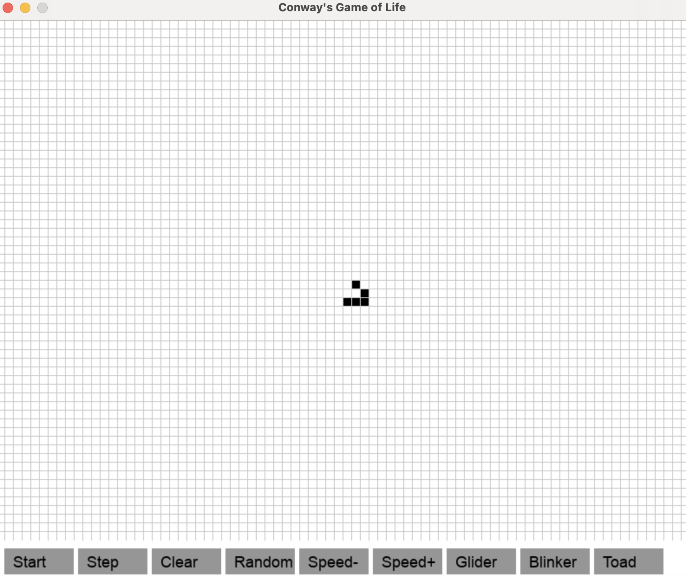

# Conway’s Game of Life

Pygame version with wrap-around edges, step mode, speed control and pattern presets.



## Quick Start

1. Install Pygame:  
   ```bash
   pip install pygame
   ```
2. Run the game:  
   ```bash
   python game.py
   ```

## Features

- Toroidal (wrap-around) grid  
- Pause + single-step mode  
- Speed up/down  
- Load presets: Glider, Blinker, Toad  

## Controls

- **Left click**: Toggle cell (only when paused)  
- **Start/Pause**: Run or pause evolution  
- **Step**: Advance one generation (paused)  
- **Clear**: Empty the grid  
- **Random**: Randomize cells  
- **Speed+ / Speed-**: Increase or decrease FPS  
- **Glider / Blinker / Toad**: Load pattern at centre  

## Rules

1. Live cell with 2–3 neighbors survives  
2. Dead cell with exactly 3 neighbors becomes alive  
3. All others die or stay dead  

## License

MIT